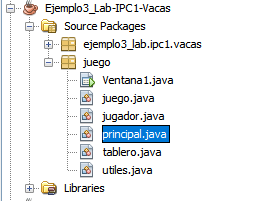

# Juego Prueba
> Vacaciones Junio 2020

> Autor: Elmer Real

> IPC1, Seccion N

## Contenido

- [Requerimientos](#requerimientos)
- [Manual de juego](#manual-de-juego)
- [Clases](#clases)
- [Metodos](#metodos)

## Requerimientos

- Procesador intel corei7
- Ram 12 GB
- Tarjeta de video
- Internet

## Manual de juego

### Menu principal

## Clases

- Ventana
    - Solo fue un ejemplo para el drag and drop
- Juego
    - Clase que contiene toda la logica del juego
    - Metodos Importantes
        - logica():
            - Imprime el tablero y espera el nuevo movimiento del jugador.
        - moverHorizontal(String direccion):
            - Recibe una cadena con la direccion a moverse y cambia de posicion en la matriz.
        - moverVertical(String direccion):
            - Recibe una cadena con la direccion a moverse y cambia de posicion en la matriz.
        - validarObstaculo():
            - Revisa despues de cada movimiento si no colisiono con un obstaculo para contabilizarlo.
        - validarFicha():
            - Revisa despues de cada movimiento si no colisiono con una ficha para contabilizarlo.
## Metodos